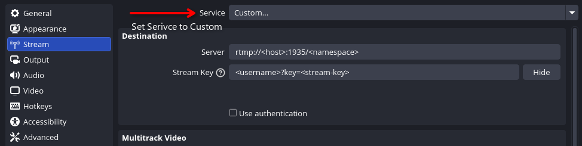

# Usage Guide

## Login Page (`/login`)

Just a login page

## Admin Page (`/admin`)

On the first login with a generated password, user will be asked to change password first.

When you add a user, the system generates a temporary password and shows it once on the page.

- copy and share the temporary password

## User Panel (`/panel`)

On the first login with a generated password, user will be asked to change password first.

In OBS in Settings/Stream set Service to `Custom...`

After that, check panel for stream details:
- RTMP URL: `rtmp://<host>:1935/<namespace>` goes in to Server
- Stream key: `<username>?key=<stream-key>` goes in to Stream Key
- VRChat URL: `rtspt://<host>:8554/<namespace>/<username>` goes in to VRChat player

The page has copy buttons for each field.
